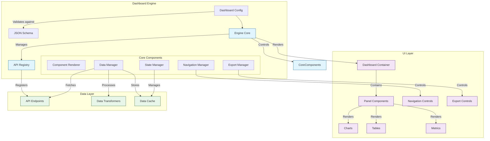

# Schema-Driven Dashboard Engine

## Table of Contents
- [Background](#background)
- [Introduction](#introduction)
- [Features](#features)
- [Architecture](#architecture)
- [Integration](#integration)

## Background
Traditional dashboards often require significant development effort for both frontend and backend teams to implement new features or modify existing ones. This coupling between frontend and backend makes it challenging to iterate quickly and adapt to changing business needs. Additionally, maintaining multiple dashboards with different layouts and functionalities can become complex and time-consuming.

## Introduction
The proposed schema-driven dashboard engine is a flexible and configurable solution that decouples dashboard configuration from implementation. By using a JSON schema approach, it allows for dynamic creation and modification of dashboards without requiring code changes. The engine acts as a middleware layer that interprets the schema configuration and renders the appropriate components while handling data fetching and transformations.

## Features

### 1. Schema-Driven Configuration
- **Declarative Definition**: Dashboards are defined using a JSON schema that specifies all aspects of the dashboard
- **Dynamic Layout**: Configurable grid-based layout system using x, y, w, h coordinates
- **Component Types**: Support for various visualization types:
  - Metrics
  - Charts
  - Tables
  - Pie Charts
  - Timelines

### 2. Data Integration
- **API Registry**: Register and manage multiple data sources through API endpoints
- **Query Configuration**:
  - Flexible payload structure for API calls
  - Support for multiple queries per panel
  - Custom result transformations
- **Global Context**:
  - Shared data across panels
  - Global filtering capabilities
  - Deferred data loading for optimization

### 3. Customization
- **Visual Components**: 
  - Customizable panel titles and descriptions
  - Configurable refresh intervals
  - Show/hide functionality for panels
- **Data Processing**:
  - Custom data aggregation
  - Result transformation pipelines
  - Dynamic payload generation

### 4. User Experience
- **Responsive Layout**: Grid-based system for different screen sizes
- **Interactive Filtering**: Global filter support across panels
- **Real-time Updates**: Configurable refresh intervals for data

### 5. Advanced Data Interactions

#### Data Export

```json
{
  "panels": {
    "items": {
      "properties": {
        "export": {
          "type": "object",
          "properties": {
            "enabled": {
              "type": "boolean"
            },
            "formats": {
              "type": "array", 
              "items": {
                "type": "string",
                "enum": ["csv", "excel", "pdf"]
              }
            }
          }
        }
      }
    }
  }
}
```

#### Data Navigation

```json
{
  "panels": {
    "items": {
      "properties": {
        "navigation": {
          "type": "object",
          "properties": {
            "target": {
              "type": "string",
              "description": "Target route or domain"
            },
            "filterMapping": {
              "type": "object",
              "description": "Maps panel data to target filters"
            },
            "trigger": {
              "type": "object",
              "properties": {
                "event": {
                  "type": "string",
                  "enum": ["click", "doubleClick"]
                },
                "element": {
                  "type": "string",
                  "description": "Specific element to trigger navigation"
                }
              }
            }
          }
        }
      }
    }
  }
}
```

## Architecture



The architecture follows a modular design where:
- The engine acts as the central coordinator
- Components are rendered based on schema configuration
- Data flow is managed through the registry and data manager
- Navigation and export features are handled by dedicated managers
- State management ensures consistent data across components

## Integration

### 1. Implementation Steps
```typescript
import { DashboardEngine } from '@dashboard/engine';

const engine = new DashboardEngine({
  apiRegistry: {
    SettlementCashflowsQuery: (payload) => api.get('/settlements/cashflows', payload),
    SettlementGroupBlotterQuery: (payload) => api.get('/settlements/blotter', payload)
  }
});
```

### 2. Dashboard Configuration
```typescript
const dashboardConfig = {
  title: "Settlement Dashboard",
  panels: [
    {
      id: "settlements-panel",
      type: "table",
      export: {
        enabled: true,
        formats: ["csv", "excel"]
      },
      navigation: {
        target: "/settlement-details",
        filterMapping: {
          "settlementId": "row.id",
          "date": "context.selectedDate",
          "counterparty": "row.counterpartyId"
        },
        trigger: {
          event: "click",
          element: "row"
        }
      }
    }
  ]
};

engine.loadDashboard(dashboardConfig);
```

### 3. Usage in Application
```typescript
<DashboardProvider engine={engine}>
  <Dashboard id="settlement-dashboard" />
</DashboardProvider>
```

### Benefits
1. **Consistent Behavior**
   - Navigation patterns are defined in configuration
   - Export functionality follows a standard pattern
   - Reduces need for custom event handlers

2. **Flexible Filter Mapping**
   - Map any data point from the panel to target route parameters
   - Support for both static and dynamic filter values
   - Context-aware navigation using global dashboard state

3. **Maintainable Integration**
   - Single source of truth for navigation rules
   - Easy to update navigation paths and filter mappings
   - Consistent user experience across different panels

4. **Reduced Development Overhead**
   - No need for custom click handlers for each panel type
   - Export functionality is standardized and reusable
   - Navigation logic is handled by the engine

This schema-driven approach significantly reduces the complexity that traditionally required coordination between frontend and backend teams, providing a consistent and maintainable way to implement dashboard features across different configurations.
```

Now the markdown is properly formatted with:
- Correct code block syntax highlighting
- Proper heading hierarchy
- Consistent spacing
- Correct mermaid diagram formatting
- Clean list formatting

You can directly copy this content into your README.md file and it should render correctly on GitHub or other markdown viewers.

